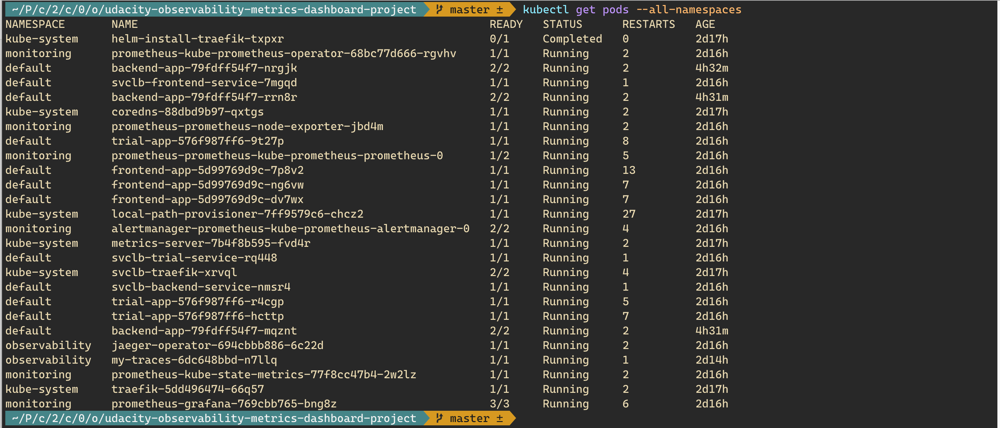
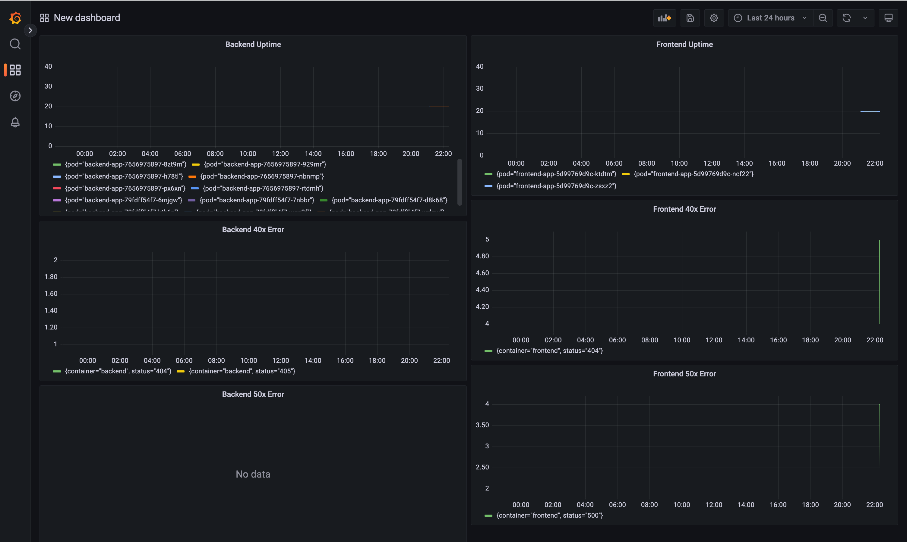

**Note:** For the screenshots, you can store all of your answer images in the `answer-img` directory.

## Verify the monitoring installation

*TODO:* run `kubectl` command to show the running pods and services for all components. Take a screenshot of the output and include it here to verify the installation



## Setup the Jaeger and Prometheus source
*TODO:* Expose Grafana to the internet and then setup Prometheus as a data source. Provide a screenshot of the home page after logging into Grafana.


## Create a Basic Dashboard
*TODO:* Create a dashboard in Grafana that shows Prometheus as a source. Take a screenshot and include it here.


## Describe SLO/SLI
*TODO:* Describe, in your own words, what the SLIs are, based on an SLO of *monthly uptime* and *request response time*.

- An SLI is a service level indicator which is a carefully defined quantitative measure of some aspect of level of service that is provided. Most services consider
  - Request latency - How long it takes to return a response to a request.
  - Error rate - The errors often expressed as a fraction of all requests received.
  - System throughput - Typically measured in requests per second.
  - Uptime - The percentage of system availability during a defined period.
  - Trafic - The amount of stress on a system from demand.
- An SLO is a service level objective which is a target value or range of values for a service level that is measured by an SLI. For example,
  - Latency can exceed 300 ms in only 5 percent of the requests over a rolling 30-day period.
  - The system must have 99% availability measured over a calendar week.

## Creating SLI metrics.
*TODO:* It is important to know why we want to measure certain metrics for our customer. Describe in detail 5 metrics to measure these SLIs.

**Request Latency**

- How long it takes to return a response to a request. The time taken to serve a request (usually measured in ms).

**Error Rate** 

- The errors often expressed as a fraction of all requests received. (eg. percentage of HTTP 500 responses).

**System Throughput**

- Typically measured in requests per second.

**Uptime** 

- The percentage of system availability during a defined period (eg. 1 day or 1 month).

**Traffic** 

- The amount of stress on a system from demand (eg. the number of HTTP requests/second).

## Create a Dashboard to measure our SLIs
*TODO:* Create a dashboard to measure the uptime of the frontend and backend services We will also want to measure to measure 40x and 50x errors. Create a dashboard that show these values over a 24 hour period and take a screenshot.



## Tracing our Flask App
*TODO:*  We will create a Jaeger span to measure the processes on the backend. Once you fill in the span, provide a screenshot of it here. Also provide a (screenshot) sample Python file containing a trace and span code used to perform Jaeger traces on the backend service.

Refer to `/reference-app/backend/app.py`

```Python
from flask import Flask, render_template, request, jsonify

import pymongo
from flask_pymongo import PyMongo

import logging
from jaeger_client import Config
from prometheus_flask_exporter import PrometheusMetrics

import os

app = Flask(__name__)
metrics = PrometheusMetrics(app)

metrics.info('app_info', 'Application info', version='1.0.3')

by_full_path_counter = metrics.counter('full_path_counter', 'counting requests by full path', labels={
                                       'full_path': lambda: request.full_path})

by_endpoint_counter = metrics.counter('endpoint_counter', 'counting requestby endpoint', labels={
                                      'endpoint': lambda: request.endpoint})

endpoints = ('', 'star', 'api')

JAEGER_AGENT_HOST = os.getenv('JAEGER_AGENT_HOST', 'localhost')

app.config["MONGO_DBNAME"] = "example-mongodb"
app.config[
    "MONGO_URI"
] = "mongodb://example-mongodb-svc.default.svc.cluster.local:27017/example-mongodb"

mongo = PyMongo(app)

# Tracing Initialization


def init_tracer(service_name="backend-service"):
    logging.getLogger('').handlers = []
    logging.basicConfig(format='%(message)s', level=logging.DEBUG)

    config = Config(
        config={
            'logging': True,
        },
        service_name=service_name,
        validate=True
    )

    return config.initialize_tracer()


tracer = init_tracer("backend-service")


@app.route("/")
@by_full_path_counter
@by_endpoint_counter
def homepage():
    app.logger.info('Hit the homepage')
    with tracer.start_span('homepage-span') as span:
        span.set_tag('homepage-tag', '95')
        return "Hello World"


@app.route("/api")
@by_full_path_counter
@by_endpoint_counter
def my_api():
    app.logger.info('Hit the /api endpoint')
    with tracer.start_span('my_api_span') as span:
        span.set_tag('my_api-tag', '90')
        answer = "something"
        return jsonify(reponse=answer)


@app.route('/star', methods=['POST'])
@by_full_path_counter
@by_endpoint_counter
def add_star():
    app.logger.info('Hit the /star endpoint')

    with tracer.start_span('star_span') as span:
        span.set_tag('star-tag', '80')

        try:
            star = mongo.db.stars
            name = request.json['name']
            distance = request.json['distance']
            star_id = star.insert({'name': name, 'distance': distance})
            new_star = star.find_one({'_id': star_id})
            output = {'name': new_star['name'],
                      'distance': new_star['distance']}
            return jsonify({'result': output})
        except Exception as e:
            print(e)


@app.route('/error')
@by_full_path_counter
@by_endpoint_counter
def oops():
    return ':(', 500


if __name__ == "__main__":
    app.run(threaded=True)
```


## Jaeger in Dashboards
*TODO:* Now that the trace is running, let's add the metric to our current Grafana dashboard. Once this is completed, provide a screenshot of it here.


## Report Error
*TODO:* Using the template below, write a trouble ticket for the developers, to explain the errors that you are seeing (400, 500, latency) and to let them know the file that is causing the issue also include a screenshot of the tracer span to demonstrate how we can user a tracer to locate errors easily.

TROUBLE TICKET

Name: "Teerapat Prommarak"

Date: "2022-06-17"

Subject: "Endpoint /star request failed"

Affected Area: "./reference-app/backend/app.py"

Severity: "Critical"

Description: "When user send request with HTTP POST method to backend api with url endpoint "/star" it produce error 500 Internal Server Error, possible because MongoDB database is not available in local cluster."

## Creating SLIs and SLOs
*TODO:* We want to create an SLO guaranteeing that our application has a 99.95% uptime per month. Name four SLIs that you would use to measure the success of this SLO.

Ans:

1. **Saturation**: Percentage of CPU usage and Memory consumption.
2. **Uptime**: The application/service should be up and running for at least 99.9% of the time on monthly basis.
3. **Latency**: The average request response time should not exceed 15ms on monthly basis.
4. **Error Rate**: The 20X status codes should be recorded for not less than 99.9% of the total requests whereas the 50X and 40X status codes should be recorded for less than 0.1% on all of the http requests made in month.

## Building KPIs for our plan
*TODO*: Now that we have our SLIs and SLOs, create a list of 2-3 KPIs to accurately measure these metrics as well as a description of why those KPIs were chosen. We will make a dashboard for this, but first write them down here.

**KPI for Saturation**: How "full" your service is. A measure of system fraction, emphasizing the resources that are most constrained.

- CPU consumption should be less than 85%
- Memory consumption should be less than 85%

**KPI for Uptime**: Uptime need to be approximate 99% within a month and response time should be around 250 milliseconds.

- application uptime should be greater than 99.5%
- % of request under 250ms should be more than 99%

**KPI for Errors**: The rate of requests that fail, either explicitly (e.g., HTTP 500s), implicitly (for example, an HTTP 200 success response, but coupled with wrong message) to be measured.

- errors per second (non HTTP 200) in last 3 hour
- successful request (HTTP 200) per second in last 3 hour

**KPI for Traffic/Latency**: A measure of how much demand is being placed on your system, measured in a high-level system-specific metric.

- Average response response time measured over 30 seconds intervals for successful requests in last 3 hour.

## Final Dashboard
*TODO*: Create a Dashboard containing graphs that capture all the metrics of your KPIs and adequately representing your SLIs and SLOs. Include a screenshot of the dashboard here, and write a text description of what graphs are represented in the dashboard.  


Description

1. CPU Usage: This represents the CPU usage of the backend application.
2. Memory Usage: This represents the memory usage of the backend application.
3. Average Response Time: This represents the average response time of the application per request.
4. 40x Errors panel: Represents the 40x (error) responses of the application.
5. 50x Errors panel: Represents the 50x (error) responses of the application.
6. Error Rate: Number of failed rate (non HTTP Status Code 200) response per second.
